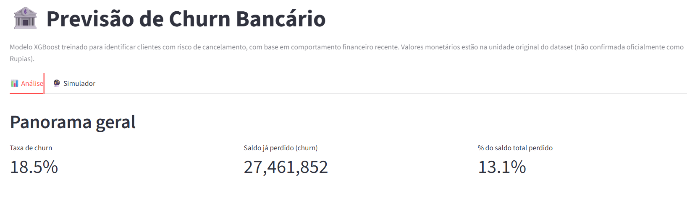
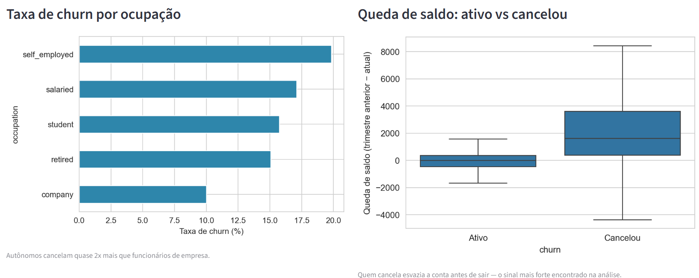
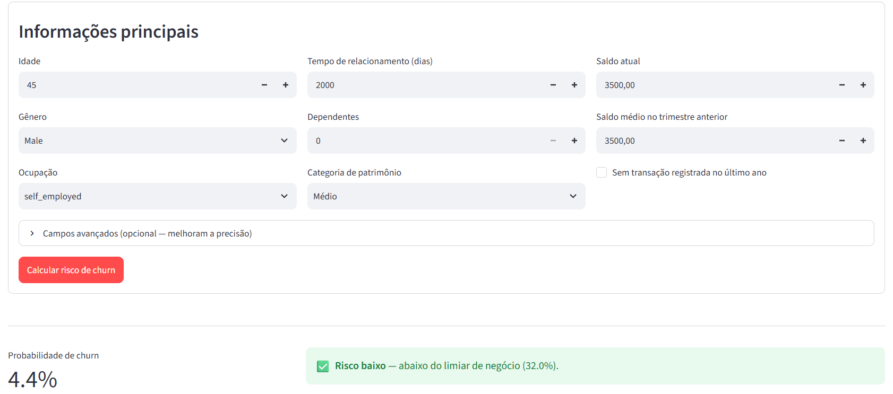

# Bank Churn Prediction Dashboard

Modelo preditivo e dashboard interativo para identificar clientes de um banco com risco de cancelamento (churn) e estimar o impacto em receita.

[]()
[]()
[]()
[]()

🔗 **[Acesse o dashboard ao vivo](https://bank-churn-prediction-dashboard-2azfey4fpwgbqutgvc8hx8.streamlit.app)**



---

## 📌 Sumário

- [Problema de negócio](#-problema-de-negócio)
- [Coleta de dados](#-coleta-de-dados)
- [Análise exploratória](#-análise-exploratória)
- [Modelagem](#-modelagem)
- [Visualização dos resultados](#-visualização-dos-resultados)
- [Conclusões](#-conclusões)
- [Dashboard](#-dashboard)
- [Como executar](#-como-executar)
- [Estrutura do projeto](#-estrutura-do-projeto)
- [Tecnologias](#-tecnologias)
- [Autora](#-autora)

---

## 🎯 Problema de negócio

A base analisada apresenta uma taxa de churn de **18,5%**. O objetivo deste projeto é identificar, antes do cancelamento acontecer, quais clientes estão em risco, para apoiar a priorização das ações de retenção.

> **Importante:** os percentuais apresentados neste projeto descrevem a base pública utilizada. Eles não devem ser interpretados como indicadores de uma instituição bancária real nem como benchmark do setor.

## Objetivos

* Identificar clientes com alta probabilidade de cancelamento antes que aconteça
* Entender **por que** clientes cancelam, não só prever quem vai cancelar
* Priorizar quais clientes a equipe de retenção deve contatar primeiro
* Entregar os resultados em um dashboard interativo, sem depender de um analista para gerar cada relatório

## Perguntas de Negócio Respondidas

|Pergunta|Resposta|
|-|-|
|Qual a taxa de churn?|18,5%|
|Quanto já foi perdido?|13,1% do saldo total da base|
|Existe perfil demográfico de quem cancela?|Não — idade, tempo de relacionamento e dependentes são quase iguais entre grupos|
|Ocupação importa?|Sim — autônomos cancelam quase 2x mais que funcionários de empresa (19,8% vs 10,0%)|
|Qual o sinal mais forte?|Queda de saldo no trimestre — quem cancela esvazia a conta antes de sair|
|Onde priorizar a retenção?|Cruzar clientes de alto saldo (top 10%) com sinal de queda de saldo|

---

## Estrutura do projeto

```
bank-churn-prediction-dashboard/
├── assets/
│   ├── tela-inicial.png
│   ├── eda.png
│   └── simulador-churn.png
├── data/
│   ├── raw/                    # Dataset original (nunca editado)
│   └── processed/              # Dataset tratado, pronto para análise/modelagem
├── notebooks/
│   ├── 01_data_cleaning.ipynb      # Tratamento de dados: ausentes, outliers, tipos
│   ├── 02_eda_negocio.ipynb        # Análise exploratória orientada a negócio
│   └── 03_modelagem.ipynb          # Comparação de modelos, tuning, impacto de negócio
├── models/
│   ├── modelo_churn_xgboost.pkl    # Modelo final treinado
│   └── metadata.json               # Limiar de decisão e métricas do modelo
├── src/
│   └── app.py                      # Dashboard Streamlit (Análise + Simulador)
├── requirements.txt
└── README.md
```

## Coleta de dados

**Fonte:** [Bank Customer Churn Data](https://www.kaggle.com/datasets/pentakrishnakishore/bank-customer-churn-data) (Kaggle, por Penta Krishna Kishore) — 28.382 clientes, 21 colunas.

A base é pública e de terceiros. Portanto, os resultados refletem as características e limitações desse dataset e não representam necessariamente o comportamento de clientes de um banco específico. A estrutura dos dados sugere relação com o mercado bancário indiano, mas a fonte utilizada não fornece contexto suficiente para confirmar a moeda dos valores monetários.

**Principais decisões de tratamento** (detalhadas em `01_data_cleaning.ipynb`):

* Valores ausentes em `dependents`, `city`, `gender` e `occupation` tratados individualmente, com decisão justificada para cada coluna
* Outliers em `dependents` (valores como 52) tratados como erro de cadastro
* ~800 clientes com menos de 18 anos **mantidos intencionalmente**, como hipótese compatível com a existência de contas de menores
* Saldo negativo transformado em uma feature própria (`saldo_negativo`) em vez de removido, por poder representar um sinal relevante

## Análise exploratória

A EDA foi orientada pelas perguntas de negócio e buscou identificar padrões associados ao churn, além de testar hipóteses antes da modelagem.

## Principais Insights (EDA de Negócio)

Detalhados em `02_eda_negocio.ipynb`:



* **O sinal mais forte não é quem o cliente é, é o que ele está fazendo com o dinheiro.** Clientes que cancelam tinham saldo médio *maior* no trimestre anterior, mas *esvaziaram* a conta antes de sair (queda média de 3.322, contra uma leve alta de 613 entre quem ficou) — essa feature (`queda_saldo`) se mostrou o preditor mais poderoso do projeto.
* **Ocupação é um sinal de negócio válido:** autônomos cancelam quase 2x mais que funcionários de empresa.
* **Uma hipótese testada e descartada:** esperava-se que a ausência de transação recente indicasse maior risco — o oposto se confirmou. Reportado com transparência, não escondido.
* **Perfil demográfico (idade, tempo de relacionamento, dependentes) não diferencia quem cancela** — reforça que comportamento financeiro > características fixas do cliente.

## Modelagem

Detalhado em `03_modelagem.ipynb`. Três modelos foram comparados com parâmetros padrão:

|Modelo|Recall|Precision|F1-Score|ROC-AUC|
|-|-|-|-|-|
|Logistic Regression|0,647|0,340|0,446|0,740|
|Random Forest|0,432|0,722|0,540|0,849|
|XGBoost|0,568|0,621|0,594|0,815|

**Critério de seleção:** o XGBoost apresentou o maior F1-Score entre os três modelos, combinando recall e precision. O Random Forest apresentou ROC-AUC superior, mas recall menor. Como o objetivo do projeto é identificar clientes em risco mantendo equilíbrio entre encontrar churners e limitar falsos positivos, o F1-Score foi adotado como principal critério para a escolha inicial.

O XGBoost foi então otimizado com `RandomizedSearchCV` usando **5-fold cross-validation**. No conjunto de teste, o modelo tunado atingiu aproximadamente **F1-Score 0,606** e **ROC-AUC 0,838**.

> **Prevenção de data leakage:** `queda_saldo` é calculada como `average_monthly_balance_prevQ - current_balance`. Neste projeto, ela é tratada como informação disponível antes do evento de churn. Como a documentação pública da base não descreve completamente a janela temporal de cada variável, essa premissa deve ser validada com a definição original dos dados antes de uma aplicação real.

**Ajuste de limiar orientado a negócio:** o limiar foi calibrado para atingir aproximadamente **75% de recall**. Na ausência de custos reais de retenção e de perda de clientes no dataset, essa escolha representa uma premissa de negócio: priorizar a identificação de churners, aceitando mais falsos positivos.

**Impacto no conjunto de teste:** na execução registrada no notebook, o modelo sinaliza **1.699 clientes (29,9% da base de teste)** e identifica corretamente **55,5% do saldo associado aos clientes que efetivamente cancelaram**. Esse resultado é retrospectivo e não representa economia financeira, receita preservada ou ROI.

**Limitações:** o dataset não informa motivo de cancelamento, satisfação do cliente ou histórico além de um trimestre. Antes de uma aplicação real, seria necessário validar a disponibilidade temporal das variáveis, utilizar dados históricos reais da instituição e incorporar informações adicionais, se disponíveis.

## Visualização dos resultados

A comunicação dos resultados segue a sequência **problema → sinais encontrados → capacidade preditiva → priorização de ações**. O dashboard transforma os principais achados da EDA e o modelo em uma interface explorável, enquanto os notebooks preservam a análise técnica e a rastreabilidade.

## Conclusões

A análise indica que o comportamento financeiro, especialmente a queda de saldo, contém mais informação para a previsão de churn do que características demográficas isoladas. O XGBoost tunado apresentou F1-Score de aproximadamente 0,606 e ROC-AUC de 0,838 no conjunto de teste.

Com o limiar escolhido para aproximadamente 75% de recall, a execução registrada sinalizou 29,9% dos clientes do conjunto de teste e identificou corretamente 55,5% do saldo associado aos clientes que efetivamente cancelaram.

Os resultados devem ser interpretados dentro das limitações da base pública. Antes de uma aplicação real, seria necessário validar a disponibilidade temporal das variáveis no momento da previsão, utilizar dados históricos reais da instituição e incorporar informações como motivo de cancelamento e satisfação do cliente, se disponíveis.

## Dashboard

Construído em Streamlit, com duas abas:

* **📊 Análise** — os principais achados da EDA de negócio, com gráficos interativos e filtro por ocupação
* **🔮 Simulador** — formulário que recebe dados de um cliente (real ou hipotético) e retorna a probabilidade de churn em tempo real, usando o modelo treinado



### Como rodar

```bash
git clone https://github.com/TalitaLuci/bank-churn-prediction-dashboard.git
cd bank-churn-prediction-dashboard
pip install -r requirements.txt
streamlit run src/app.py
```

O dashboard abre automaticamente em `http://localhost:8501`.


## Observações

* **Moeda não confirmada:** valores tratados sem símbolo monetário até confirmação da fonte oficial dos dados
* **Sem dado de motivo de cancelamento:** o modelo prevê *que* o cliente vai cancelar, não *por quê* além do que os dados financeiros revelam
* **Próximo passo natural:** incorporar dado de satisfação/motivo de contato do cliente, se disponível, para complementar o sinal puramente financeiro


---

## 🛠 Tecnologias

- **Linguagem:** Python 3.11+
- **Análise:** pandas, numpy
- **Visualização:** matplotlib, seaborn, plotly
- **Machine Learning:** scikit-learn, XGBoost
- **Dashboard:** Streamlit
- **Serialização:** joblib

---


## 👩‍💻 Autora

**Talita Luci**

[](https://github.com/TalitaLuci)
[](https://www.linkedin.com/in/talita-luci)

